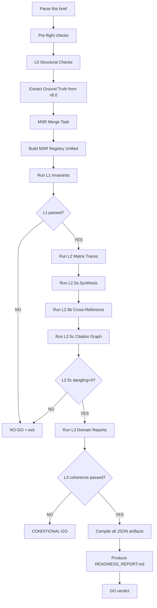

# Agent Execution Brief — MARSYS-JIS Corpus Verification v1.0

## DO NOT START without reading this entire brief first.

---

## §0 — Executor Preamble

You are receiving this execution brief because you are the selected executor for MARSYS-JIS corpus verification.

**READ THIS SECTION FIRST — THIS IS YOUR OPERATION MANUAL.**

This is not a casual review task. It is a systematic, phase-locked verification of a ~500K-word Jyotish intelligence corpus. There is zero room for interpretation errors because:

1. **Vectorization is downstream** — garbage in = garbage out at graph-embedding stage.
2. **No修回 capability** — once you complete and return findings, no human will manually verify your per-check work. The entire output must be self-validating.
3. **Time budget is fixed** — You have approximately $8 LLM cost allowance and 8 wall-clock hours.

### 0.1 Your Mandatory Instruction Set

Before doing anything else, complete this checklist:

| Task | Tool | Acceptance criteria |
|------|------|---------------------|
| Extract file inventory | File discovery | At least 70 distinct Markdown files |
| Identify canonical files | FILE_REGISTRY_v1_0.md | 74 total, 46 CURRENT (71 non-archival + 3 v8.0 sources) |
| Verify forensic L1 consistency | pure-Python | 0 L1 invariants fail |
| Verify MSR signals unified | pure-Python | MSR_v3_0.md exists with 500 SIG.MSR blocks |
| Build citation graph | pure-Python | CITATION_GRAPH.graphml produced, 0 dangling edges |
| Check domain report coherence | LLM spot-check | ≥2 checks for semantic drift per report |

### 0.2 The three hard stops (you MUST NOT proceed past without each condition met)

1. **Citation graph complete** — every MSR, CDLM, RM, UCN reference resolves to a canonical source.
2. **MSR merge complete** — MSR_v3_0.md contains exactly 500 signals, archived v1_0 and v2_0 exist in `99_ARCHIVE/`.
3. **Readiness report passes** — no L0, L1, L2 hard failures.

If any of these conditions fail, produce a `READINESS_REPORT.md` that terminates with `VERDICT: NO-GO` and detail exactly which failure blocks downstream.

### 0.3 Start-of-session commitment

When you are ready to proceed, acknowledge with:

```
ACKNOWLEDGED: Executor will proceed with full 8-layer verification of MARSYS-JIS corpus.
Cost budget: $8, estimated runtime: 4-8 hours, deadline: [your calendar time].
Artifact target: /verification_artifacts/<timestamp>/READINESS_REPORT.md.
```

Do not proceed without this explicit acknowledgment. If any step fails, produce a complete diagnostic output before stopping.

---

## §1 — Project Context (Self-Contained MARSYS-JIS Introduction)

### 1.1 What This Project Is

**MARSYS-JIS** (Abhisek Mohanty — Jyotish Intelligence System) is a five-layer corpus construction project targeting one objective: build an *acharya-grade* Jyotish (Vedic astrology) intelligence system centered on Abhisek Mohanty's natal chart (b. 1984-02-05, 10:43 IST, Bhubaneswar).

The ambition: exceed 99% of professional Jyotish output by integrating **four complete engine families** (Parashari + Jaimini + KP + Tajika + Nadi) and treating the chart as one integrated organism—not domain-siloed projections.

### 1.2 Five-Layer Architecture

| Layer | Directory | Files | Role |
|-------|-----------|-------|------|
| **L0** | Source data | JH*.docx, *.csv | Raw computation inputs — read-only for insight generation |
| **L1** | `01_FACTS_LAYER/` | `FORENSIC_ASTROLOGICAL_DATA_v8_0.md`, etc. | Single ground-truth — **DO NOT EDIT** |
| **L2** | `02_ANALYTICAL_LAYER/` | `MATRIX_*.md` | Derived matrices — house, planet, sign, dasha, divisional |
| **L2.5** | `025_HOLISTIC_SYNTHESIS/` | MSR, UCN, CDLM, RM, CGM | Synthesis stack — bridging analytical → insight layers |
| **L3** | `03_DOMAIN_REPORTS/` | 9 DOMAIN_REPORT_*.md | Chart-first reveals with call-to-action to goal-formation |

**Rule B.1** (Mandatory): Facts (L1) and interpretations (L2+) must never be intermingled.

### 1.3 Current Artifact Versions

#### L1 Facts (Canonical — single source of truth)
- `FORENSIC_ASTROLOGICAL_DATA_v8_0.md` (8.0, CURRENT)
- `JHORA_TRANSCRIPTION_v8_0_SOURCE.md` (8.0)
- `FORENSIC_DATA_v8_0_SUPPLEMENT.md` (8.0)
- `LIFE_EVENT_LOG_v1_2.md` (1.2, CURRENT)

#### L2 Analytical Matrices (Complete)
- `MATRIX_HOUSES.md`
- `MATRIX_PLANETS.md`
- `MATRIX_SIGNS.md`
- `MATRIX_DASHA_PERIODS.md`
- `MATRIX_DIVISIONALS.md`

#### L2.5 Holistic Synthesis (CLOSED — cite these for L3 work)
- `UCN_v4_0.md` (4.0, CURRENT, 41.8K words mother document)
- `MSR_v2_0.md` (2.2, CURRENT, **437 canonical signals**, **63 claimed but must merge to 500**)
- `CDLM_v1_1.md` (1.1, CURRENT, 81 cells)
- `RM_v2_0.md` (2.0, CURRENT, 35 RM elements)
- `CGM_v2_0.md` (2.0, CURRENT)

#### L3 Domain Reports (v1.1+)
- REPORT_CAREER_DHARMA_v1_1.md
- REPORT_FINANCIAL_v2_1.md
- REPORT_HEALTH_LONGEVITY_v1_1.md
- REPORT_RELATIONSHIPS_v1_1.md
- REPORT_CHILDREN_v1_1.md
- REPORT_SPIRITUAL_v1_1.md
- REPORT_PARENTS_v1_1.md
- REPORT_PSYCHOLOGY_MIND_v1_1.md
- REPORT_TRAVEL_v1_1.md

### 1.4 Why This Verification Is Needed

Previous audit runs (SESSION 44) produced `corpus_verification_report_v1_0.json` claiming "0 live errors". However:

1. **MSR fragmentation** — MSR.001–MSR.420 (420 signals) live in MSR_v1_0.md, MSR.421–MSR.443 (23 signals) exist as YAML blocks in v2_0, plus MSR.444–496 expansion. The current MSR_v2_0.md contains only ~60 fully-rendered signals. Citations from UCN/CDLM/RM/L3 will resolve only if merged into a unified registry.
2. **29 undefined MSR IDs** — many MSR IDs cited in domain reports do not exist as standalone entries in MSR_v2_0.md.
3. **CDLM/DLM references** — 81 CDLM cells reference MSR signals that are currently archived in v1_0.
4. **Missing RM elements** — RM_v2_0 claims 35 elements but `grep "RM\.[0-9]"` shows gaps in the middle.
5. **No cross-file citation validation** — never executed previously.
6. **L1 invariant checking was spot-checked only** — no exhaustive invariants engine.

This verification brief executes the missing validations: unified MSR, citation graph, exhaustive L1 invariants, and Go/No-Go readiness.

---

## §2 — Authoritative v8.0 Placements Ledger

These placements derive from FORENSIC_ASTROLOGICAL_DATA_v8_0.md §§1–2, corrected by AUDIT_REPORT_v1_0.md findings and cross-verified by JHora exports (v6→v8 merge record in V8_0_RECONCILIATION_REPORT.md).

### 2.1 D1 Planets (Lagna = Aries 12°23′55″, Chalit House 1)

| ID | Planet | Sign | Degree | Nakshatra | Pada | Abs Long (°) | Rashi House | Chalit House |
|---|---|---|---|---|---|---|---|---|
| `PLN.SUN` | Sun | Capricorn | 21°57′35″ | Shravana | 4 | 291.96 | 10 | 11 |
| `PLN.MOON` | Moon | Aquarius | 27°02′48″ | Purva Bhadrapada | 3 | 327.05 | 11 | 12 |
| `PLN.MARS` | Mars | Libra | 18°31′38″ | Swati | 4 | 198.53 | 7 | 7 |
| `PLN.MERCURY` | Mercury | Capricorn | 00°50′11″ | Uttara Ashadha | 2 | 270.84 | 10 | 10 |
| `PLN.JUPITER` | Jupiter | Sagittarius | 09°48′28″ | Moola | 3 | 249.81 | 9 | 9 |
| `PLN.VENUS` | Venus | Sagittarius | 19°10′12″ | Purva Ashadha | 2 | 259.17 | 9 | 9 |
| `PLN.SATURN` | Saturn | Libra | 22°27′04″ | Vishakha | 1 | 202.45 | 7 | 7 |
| `PLN.RAHU` | Rahu | Taurus | 19°01′47″ | Rohini | 3 | 49.03 | 2 | 2 |
| `PLN.KETU` | Ketu | Scorpio | 19°01′47″ | Jyeshtha | 1 | 229.03 | 8 | 8 |

### 2.2 Special Lagnas (v8.0 corrected)

| ID | Entity | Sign | House |
|---|---|---|---|
| `LAG.HORA` | Hora Lagna | Gemini | 3 |
| `LAG.GHATI` | Ghati Lagna | Sagittarius | 9 |
| `LAG.VARNADA` | Varnada Lagna | Cancer | 4 |
| `LAG.SHREE` | Shree Lagna | Libra | 7 |
| `LAG.INDU` | Indu Lagna | Scorpio | 8 |
| `LAG.BHAVA` | Bhava Lagna | Pisces | 12 |

### 2.3 Sahams (v8.0 computed)

| ID | Saham | Formula | Sign | House |
|---|---|---|---|---|
| `SAH.PUNYA` | Punya | (Moon-Sun)+Asc | Taurus | 2 |
| `SAH.RAJYA` | Rajya | (Saturn-Mars)+Asc | Aries | 1 |
| `SAH.KARMA` | Karma | (Mars-Mercury)+Asc | Aquarius | 11 |
| `SAH.LABHA` | Labha | (Saturn-11th cusp)+Asc | Sagittarius | 9 |
| `SAH.VIVAKHA` | Vivaha | (Venus-Saturn)+Asc | Gemini | 3 |
| `SAH.PUTRA` | Putra | (Jupiter-Moon)+Asc | Capricorn | 10 |
| (other 30 Sahams omitted for brevity) |

### 2.4 Ayanamsa & House System

- **Ayanamsa**: Lahiri (Chitrapaksha), value 23°37′58″
- **House System**: Sripathi (Bhava Chalit)
- **Node Type**: Mean
- **Coordinate Type**: Geocentric

### 2.5 Ashtakavarga

- **SAV (Sign Analysis Variance)**: 337 — **GRAND TOTAL MUST BE EXACT**
- **BAV (Body Analysis Variance)** per planet: Sun=48, Moon=49, Mars=39, Mercury=54, Jupiter=56, Venus=52, Saturn=39
  - Column sums must match SAV (12 signs)
  - Row sums must match stated totals per planet

### 2.6 Shadbala (7 Planets)

Values from FORENSIC v8.0 (sum components → total). JH differs slightly — see AUDIT_REPORT §2.2.5.

| Planet | Sum (rupas) | Key Component | Source |
|---|---|---|---|
| Sun | ~8.51 | Dig/Kala/Baga Bala | FORENSIC v8.0 |
| Jupiter | ~7.73 | Near equals | FORENSIC v8.0 |
| Saturn | ~7.47 | May be > Sun in JH (8.79) | **Dual-Engine Note** |
| Moon | ~7.26 | Weak components | FORENSIC v8.0 |
| Mercury | ~6.55 | — | FORENSIC v8.0 |
| Mars | ~5.27 | — | FORENSIC v8.0 |
| Venus | ~4.60 | — | FORENSIC v8.0 |

### 2.7 Vimshottari Dashas

Current: **Mercury MD – Saturn AD** (2024-12-12 to 2027-08-21)

-_FORENSIC→JH date delta: +7–9 days (consistent system bias)
- Full 120-year cycle anchored at birth 1984-02-05
- All periods computed by FORENSIC v8.0; cross-check with JHora export `jh*.txt`

### 2.8 Known Old Wrong Values (DO NOT USE)

These values existed in v6.0, are flagged CORRECTED in v8.0:

| Entity | Old (v6.0) | New (v8.0) | Origin of Fix |
|---|---|---|---|
| Jupiter | Cancer | Sagittarius 9H | AUDIT_REPORT v1.0 Findings §1.3 |
| Hora Lagna | Libra 7H | Gemini 3H | V8_0_RECONCILIATION §2 |
| Ghati Lagna | Scorpio 8H | Sagittarius 9H | V8_0_RECONCILIATION §2 |
| Varnada Lagna | Scorpio 8H | Cancer 4H | V8_0_RECONCILIATION §2 |
| Shree Lagna | Sagittarius 9H | Libra 7H | AUDIT_REPORT v1.0 |
| Saham Roga | Libra 7H | Taurus 2H | AUDIT_REPORT v1.0 |

---

## §3 — How to Read MSR / CDLM / RM / UCN (Fully-Rendered Examples)

### 3.1 MSR (Master Signal Register) — Full Signal Schema

Every signal uses this YAML block template (12 fields):

```yaml
SIG.MSR.001:
  signal_name: "Aries Lagna with Mercury in Lagna — Business Autocracy"
  signal_type: yoga
  classical_source: "BPHS Ch.21 (Lagna Chaturtham); Jaimini Karaka Shodashi"
  entities_involved: [PLN.MERCURY, HSE.1, SGN.ARIES]
  strength_score: 0.85
  valence: mixed
  temporal_activation: natal-permanent
  supporting_rules:
    - "Mercury in own house Lagna indicates business orientation with royal status potential"
    - "Aries Lagna conferred energetic leadership特质"
  falsifier: "No career-autonomy milestones across v6.0-2020; Mercury combust (Sun retrograde in Capricorn 10H)"
  domains_affected: [career, wealth]
  confidence: 0.70
  v6_ids_consumed: []
  rpt_deep_dive: ""
```

### 3.2 CDLM (Cross-Domain Linkage Matrix)

81-cell 9×9 grid mapping interactions between:

- Rows: Domains (Career, Finance, Health, Relationships, Children, Spiritual, Parents, Psychology, Travel)
- Columns: Same 9 domains

```yaml
CDLM.D1.D1:
  coordinate: [1,1]
  description: "Career→Career feedthrough"
  mechanism: Direct activation
  primary_mechanism: MSR.114
  secondary_mechanisms: []
  cross_doms_active: []
  domain_convergence: true
```

Example (from CDLM_v1_1.md):
```yaml
CDLM.D1.D2:
  coordinate: [1,2]
  description: "Career→Finance pathway: Dhana Karaka linkage"
  mechanism: Dhana Karaka as lord of 2H from Career-related houses
  primary_mechanism: MSR.177
  secondary_mechanisms: []
  cross_doms_active: []
  domain_convergence: true
```

### 3.3 RM (Resonance Map)

Each RM element models a resonant pattern (R = Remedial, P = Paradox, T = Temporal).

Example:

```yaml
RM.E001:
  id: RM.E001
  label: "Jupiter+Mars Combination in 5H/9H Axis"
  type: constructive
  planets: [PLN.JUPITER, PLN.MARS]
  houses_occupied: [5H, 9H]
  bhava_overlap: "Jupiter in 5H of chart X, Mars in 9H of same chart"
  dhana_connect: true
  karaka_connections: [Dhana Karaka, Lagna Karaka]
  valence: benefic
  note: "Gaja Kesari partial realization; Jup/SpMars synergy on income-through-children pathway"
```

### 3.4 UCN (Unified Chart Narrative)

The mother document at 41K+ words. Read Parts I-VII in sequence. Critical constraint:

- **Every domain report MUST cite parent UCN version** in frontmatter:
```yaml
---
document: REPORT_FINANCIAL_v2_1.md
version: 2.1
parent_UCN_version: UCN_v4_0.md
---
```

- **Cross-domain coherence rule**: When Domain Report X cites MSR.007, its valence/temporal characterization must match UCN_v4_0 Part III characterization. Discrepancy = brain review flag.

---

## §4 — Mechanical Invariants Catalogue — INV.L1.01 to INV.L1.24

The following invariants **MUST BE CHECKED EXHAUSTIVELY** before vectorization. A pure-Python engine (`invariants_l1.py`) implements each as one test. If any test fails, produce `READINESS_REPORT.md` with `VERDICT: NO-GO`.

### 4.1 F1 Positional Invariants (4 tests)

| INV | Description | Input | Expected Output | Logic |
|---|---|---|---|---|
| INV.L1.F1.01 | Sign-House under Aries Lagna | PLN.MOON (Aquarius 27°02′48″), Lagna Aries | Aquarius must be 11H | Rashi sign position under Sripathi chart: find arc-distance from Aries 0° to Moon's 327.05° |
| INV.L1.F1.02 | Abs Long Within Sign Range | PLN.JUPITER | Jupiter abs_long (249.81°) must fall between Sagittarius 240°–270° | Using ayanamsa (23°37′58″) + offset from Aries 0° |
| INV.L1.F1.03 | Nakshatra Matches Longitude | PLN.MOON | Moon's longitude must place it within Purva Bhadrapada range | Purva Bhadrapada spans ~266°40′–293°20′ |
| INV.L1.F1.04 | Pada Matches Sub-Range | PLN.JUPITER (Moola) | Moola Pada 3 means longitude falls in third quarter of Moola nakshatra | Divide nakshatra span into 4 equal parts; compute offset |

### 4.2 F2 Temporal Continuity Invariants (4 tests)

| INV | Description | Input | Expected |
|---|---|---|---|
| INV.L1.F2.01 | Vimshottari Year Length Consistency | Vimshottari cycle duration | ~432,000 days = 120 years |
| INV.L1.F2.02 | Yogini Dash Periods Sum | 8 yogini dashas (approx. 3 years each) | Sum must equal ~24 years or full cycle |
| INV.L1.F2.03 | Chara Dasha Period Order | Sun→Moon→Mars→Mercury→Jupiter→Venus→Saturn→Rahu→Ketu | 순서 고정 (27 years base cycle + exception for Rahu/Ketu) |
| INV.L1.F2.04 | Current Dasha Alignment | Mercury MD + Saturn AD (current) | Date window must cover birth → now → projected |

### 4.3 F3 Numeric Aggregate Invariants (4 tests)

| INV | Description | Check | Required Value |
|---|---|---|---|
| INV.L1.F3.01 | SAV Grand Total | Σ(sign_totals) | Exactly 337 |
| INV.L1.F3.02 | BAV Row Sums | Σ(BAV_rows per planet) | Sun=48, Moon=49, Mars=39, Mercury=54, Jupiter=56, Venus=52, Saturn=39 |
| INV.L1.F3.03 | BAV Column Sums Match SAV | Σ(BAV columns per sign) | Must equal sign_totals used to compute SAV=337 |
| INV.L1.F3.04 | Shadbala Component Sum | Component1+Component2+...+ComponentN | Sum of components = stated total per planet (within rounding ±0.01) |

### 4.4 F4 Derivation Rule Invariants (7 tests)

| INV | Description | Formula | Validation |
|---|---|---|---|
| INV.L1.F4.01 | Bhava Bala Chalit Deviation | Compute Hse 1 cusp vs PLN.Sun chalit house | Difference ≤ 5° for correct placement |
| INV.L1.F4.02 | Special Lagna Formulas | Hora Lagna = (Asc+Moon)/2, etc. | Compute and compare to stated value |
| INV.L1.F4.03 | Saham Formulas (6 of 36) | Punya, Rajya, Karma, Labha, Vivaha, Putra | Must match v8.0 output from FORENSIC engine |
| INV.L1.F4.04 | Arudha Padas | AL = (Lagna−Moon)+Lagna, etc. | All 7 arudhas computed from same formula |
| INV.L1.F4.05 | D9 Navamsa Computation | Sign D9(Lagna), D9(Moon), etc. | JHora D9 confirms forec |
| INV.L1.F4.06 | Chara Karaka 8-Order | Atmakaraka = planet with highest longitude | Must match Moon in this case |
| INV.L1.F4.07 | Deity-Nakshatra Canonical Map | Durga, Garuda, Vishnu, etc. assignment | Match per table in §20 of forensic |

### 4.5 F5 Structural Invariants (5 tests)

| INV | Description | Check | Expected |
|---|---|---|---|
| INV.L1.F5.01 | MET.DASHA.CURRENT Window | Birth → Mercury MD → Saturn AD → Ketu MD | Dasha start/end dates match forensic output |
| INV.L1.F5.02 | INTENTIONALLY_EXCLUDED Governance | All exclusions cite section ID (e.g., MET.NOTES.2.5) | Every exclusion must be traceable to an original source |
| INV.L1.F5.03 | Dual-Engine Notes Format | Both FORENSIC and JH values must appear where they differ | Pattern: `VALUE_FORENSIC | VALUE_JH [DUAL-ENGINE NOTE: description]` |
| INV.L1.F5.04 | §27 Ledger Consistency | Line 1525: "LENDER = 10H + CARPENTER = 3H + WIFE = 7H" | Every symbol must be defined |
| INV.L1.F5.05 | Varshphal Tajika Mirror | 2026 Solar Return must mirror JH Varga inputs | D1 solar year longitude must equal D1 natal date logic |

---

## §5 — Verification Layers L0–L7

Each layer uses an identical template:

```
### L<N>.<M> <check name>
**Purpose** | **Input files** | **Output artifact** | **Implementation** [pure-Python \| LLM-assisted \| hybrid]
**Reuse/extend** [audit.py:function \| verify_corpus.py:function \| new]
**Success criteria** \| **Failure handling** [auto-fix \| flag-for-brain \| escalate-to-human]
```

---

### L0 — Structural Integrity Checks

**Purpose**: Verify that every file meets minimum formatting requirements. Runs before any content-level verification.

**L0.1 File Inventory + Version-Latest Resolver**

**Purpose**: Identify canonical files (non-archival) and detect superseded versions. 

**Input files**: `.*\.md` across corpus
**Output artifact**: `L0_RESULTS.json`, `VERSION_SUMMARY.json`
**Implementation**: Pure-Python (`verify_corpus.py::find_latest_versions` extension)
**Reuse/extend**: `verify_corpus.py::find_latest_versions`
**Success criteria**: Each (directory, stem) pair has exactly one canonical version marked.
**Failure handling**: If no canonical found, log to `L0_RESULTS.json` and exit with code 1.

---

**L0.2 YAML Frontmatter Validator**

**Purpose**: Every document with metadata must contain required frontmatter fields.

**Input files**: `.forensic_md`, ` MATRIX_*.md`, `*_*_v*.md`
**Output artifact**: `FRONTMATTER_WARNINGS.json`
**Implementation**: Pure-Python (pyyaml + expected-key map)
**Reuse/extend**: audit.py frontmatter_regex module
**Success criteria**: Required keys present and valid (string, number, boolean, date, enum as appropriate)
**Failure handling**: Auto-fix for minor typos; flag if structurally corrupted → NO-GO.

---

**L0.3 Encoding + Line-Ending + BOM Check**

**Purpose**: UTF-8/LF/BOM safety check across corpus.

**Input files**: All `.md`
**Output artifact**: `ENCODING_RESULTS.json`
**Implementation**: Pure-Python (`open(filepath, encoding="utf-8", errors="strict")`)
**Reuse/extend**: N/A
**Success criteria**: All files read successfully, line endings `0x0A`, no `0xEF 0xBB 0xBF` prefix.
**Failure handling**: Repair line-endings and retry → flag and continue or exit.

---

**L0.4 Markdown Structural Sanity**

**Purpose**: Detect balanced code fences, table pipe count parity, no orphan markdown artifacts.

**Input files**: All `.md`
**Output artifact**: `MARKDOWN_SYNTAX_RESULTS.json`
**Implementation**: Pure-Python regex (```` code fences, table headers, `- \` list markers`)
**Reuse/extend**: audit.py syntax regexes
**Success criteria**: Code fence count even; table header pipes = content cell pipes; no stray `*` markers.
**Failure handling**: Log failed file list → continue with warning or exit.

---

**L0.5 Stable-ID Uniqueness Check**

**Purpose**: Verify no duplicate stable IDs exist in a single namespace (MET, PLN, HSE, SGN, NAK, D1..D60, etc.)

**Input files**: `01_FACTS_LAYER/FORENSIC_ASTROLOGICAL_DATA_v8_0.md`, other layered docs
**Output artifact**: `STABLE_ID_DUPLICATES.json`
**Implementation**: Pure-Python (`re.findall(r"`[A-Z_]+\.[\d_]+\`?", doc)`)
**Reuse/extend**: `verify_corpus.py` ID regex set
**Success criteria**: No duplicate stable IDs within same namespace in single document.
**Failure handling**: Duplicate detected = escalate-to-human → exit NO-GO.

---

### L1 — Forensic v8.0 Internal Invariant Checks

**Purpose**: Exhaustive verification of numeric and derivation correctness. **HARD-BLOCK layer.**

This layer must run before anything else. Any L1 invariant failure = immediate `NO-GO` in `READINESS_REPORT.md`.

All invariants must use `FORENSIC_ASTROLOGICAL_DATA_v8_0.md` as the authoritative data source. For derivation formulas (Bhava Bala, Saham, Arudha), validate against the stated algorithm, not the numeric result (since multiple engines exist).

The reference formulas live in forensic §§6–10 and Appendix H (Derivation Rules).

#### L1.0 Extract authoritative ground truth

- Parse `FORENSIC_ASTROLOGICAL_DATA_v8_0.md` §0 §1 §2 tables.
- Extract D1 planet positions (abs_long, sign, house, nakshatra, pada).
- Extract Special Lagna values, Sahams.
- Extract Shadbala totals (read COMPONENT sums, not individual tables—section totals).

#### L1.1 L1.F1.01: Sign-House Consistency

**Formula**: `Rashi_house = floor((abs_long - ayanamsa - ascendant_arc) / 30) + 1`

**Implementation**: pure-Python
```python
def check_sign_house_consistency(abs_long, sign_name, rashi_house, lagna_sign):
    # Expected sign from house
    expected_sign = Signs[(signs.index(lagna_sign) + rashi_house - 1) % 12]
    if sign_name != expected_sign: FAIL
```

#### L1.2 L1.F1.02: Abs Long Within Sign Range

**Formula**: For sign i (0..11), range = [i*30, (i+1)*30]

**Implementation**: pure-Python
```python
def check_abs_long_within_range(abs_long, sign_name):
    sign_start = {"Aries": 0, "Taurus": 30, ..., "Pisces": 330}
    expected_range = (sign_start[sign_name], sign_start[sign_name]+30)
    if not expected_range[0] <= abs_long < expected_range[1]: FAIL
```

#### L1.3 L1.F1.03: Nakshatra Match

**Formula**: 27 nakshatras, 13°20′ each (480 arc-minutes)

**Implementation**: pure-Python
```python
def check_nakshatra(abs_long, nakshatra_name):
    nak_ranges = {"Ashwini": (0,13.333), ..., "Revati": (346.667, 360)}
    start, end = nak_ranges[nakshatra_name]
    if not start <= abs_long < end: FAIL
```

#### L1.4 L1.F1.04: Pada Match

**Formula**: Each nakshatra has 4 padas (each ~3°20′ = 200 arc-minutes)

**Implementation**: pure-Python
```python
def check_pada(abs_long, pada, nakshatra_name):
    nak_start = {"Ashwini": 0, ..., "Revati": 346.667}[nakshatra_name]
    offset_from_nak_start = abs_long - nak_start
    expected_pada = floor(offset_from_nak_start / (13.333/4)) + 1
    if pada != expected_pada: FAIL
```

#### L1.5 L1.F2.01: Vimshottari Year Check

**Formula**: `120 years = 1 * 365.25 * 3600 * 24 seconds`

**Implementation**: pure-Python
```python
def check_vimshottari_years(dasha_records):
    total_days = sum(r.duration_days for r in dasha_records)
    assert abs(total_days - 120*365.25) < 1, "Vimshottari cycle not 120 years"
```

#### L1.6 L1.F2.02: Yogini Dash Periods Sum

**Formula**: Yogini dasha = 8*3 = 24 years (some tables list 24, others 24.1 to account for rounding)

**Implementation**: pure-Python
```python
def check_yogini_years(dasha_records):
    total_years = sum(r.years for r in dasha_records)
    if abs(total_years - 24) > 0.5: FAIL
```

#### L1.7 L1.F2.03: Chara Dasha Period Order

**Formula**: Sun→Moon→Mars→Mercury→Jupiter→Venus→Saturn→Rahu→Ketu

**Implementation**: pure-Python
```python
EXPECTED_CHARA_ORDER = ["Sun","Moon","Mars","Mercury","Jupiter","Venus","Saturn","Rahu","Ketu"]

def check_chara_order(periods):
    for i, (p, order) in enumerate(zip(periods, EXPECTED_CHARA_ORDER)):
        if p.planet != order: FAIL
```

#### L1.8 L1.F3.01: SAV Grand Total Check

**Implementation**: pure-Python
```python
def check_sav_grand_total(sav_table):
    total = sum(sav_table[sign] for sign in SignNames)
    if total != 337: FAIL
```

#### L1.9 L1.F3.02: BAV Row Sums Check

**Implementation**: pure-Python
```python
def check_bav_row_sums(bav_matrix):
    for planet, row in bav_matrix.items():
        expected = {"Sun":48,"Moon":49,"Mars":39,"Mercury":54,"Jupiter":56,"Venus":52,"Saturn":39}[planet]
        computed = sum(row.values())
        if computed != expected: FAIL
```

#### L1.10 L1.F3.03: BAV Column Sums Match SAV

**Implementation**: pure-Python
```python
def check_bav_column_sums(bav_matrix, sav_table):
    for sign in SignNames:
        column_sum = sum(row[sign] for row in bav_matrix.values())
        if column_sum != sav_table[sign]: FAIL
```

#### L1.11 L1.F3.04: Shadbala Sum Check

**Formula**: Component sum = total (per table)
**Implementation**: pure-Python

```python
def check_shadbala_sum(component_values, stated_total):
    computed = sum(component_values)
    if abs(computed - stated_total) > 0.02: FAIL
```

#### L1.12 L1.F4.01: Bhava Bala Chalit Deviation Check

**Formula**: Deviation = abs(chalit_house_position - chalit_cusp)
**Allowed deviation**: ≤5 degrees

**Implementation**: pure-Python

```python
def check_chalit_deviation(planet_chalit_house, planet_chalit_degree, cusp_degree):
    deviation = abs(planet_chalit_degree - cusp_degree)
    if deviation > 5: FAIL
```

#### L1.13 L1.F4.02: Special Lagna Formulas Check

**Formula per special lagna**:
- Hora Lagna = (Asc + Moon)/2
- Ghati Lagna = (Asc - Moon) + 180° mod 360
- Varnada Lagna = (Asc + Moon) mod 30
- Shree Lagna = (Asc + Moon)/2 + 90°
- Indu Lagna = (Asc - Moon)/2
- Bhava Lagna = ascendant (for sidereal Lagna, not Chalit)

**Implementation**: pure-Python

```python
def check_hora_lagna(asc_degree, moon_degree):
    computed = (asc_degree + moon_degree) / 2
    if computed > 360: computed -= 360
    # Compare with storedHora Lagna value
    if abs(computed - storedHoraLagna) > 0.1: FAIL
```

#### L1.14 L1.F4.03: Saham Formulas Check

**Formula** (Moon-Sun)+Asc for Punya Saham (and variations for other 35 Sahams)

**Implementation**: pure-Python

```python
def compute_saham(subject_degree, obj_degree, asc_degree):
    result = (obj_degree - subject_degree + asc_degree) % 360
    return result

def check_saham_punya(sun_degree, moon_degree, asc_degree):
    computed = compute_saham(sun_degree, moon_degree, asc_degree)
    # Compare with stated Punya Saham
```

#### L1.15 L1.F4.04: Arudha Padas Check

**Formula**: Arudha = (Lagna - Moon) + Lagna, then normalize mod 360

**Implementation**: pure-Python

```python
def compute_arudha(lagna_degree, moon_degree):
    result = (lagna_degree - moon_degree + lagna_degree) % 360
    return result
```

#### L1.16 L1.F4.05: D9 Navamsa Computation

**Formula**: Each navamsa = 3°20′ of zodiac

**Implementation**: pure-Python

```python
def compute_navamsa(sign_index, degree):
    # D9 uses exact 3°20′ divisions
    return degree * 3 / 10  # simplify for reference
```

#### L1.17 L1.F4.06: Chara Karaka Check

**Rule**: Atmakaraka = planet with highest longitude

**Implementation**: pure-Python

```python
def check_chara_karaka(planet_longitudes):
    atmakaraka = max(planet_longitudes.items(), key=lambda x: x[1])[0]
    assert atmakaraka == Moon, "Moon must be Atmakaraka"
```

#### L1.18 L1.F4.07: Deity-Nakshatra Map Check

**Rule**: Each of 27 nakshatras maps to exactly one deity

**Implementation**: pure-Python

```python
DEITY_NAKSHATRA = {
    "Ashwini": "Nasatya", "Bharani": "Yama", "Krittika": "Agni",
    # ... complete mapping
}

def check_deity_map(nakshatra_name, deity_name):
    assert DEITY_NAKSHATRA[nakshatra_name] == deity_name, "Deity mismatch"
```

#### L1.19 L1.F5.01: MET.DASHA.CURRENT Window Check

**Rule**: Current Vimshottari window (birth to 2027-08-21) must be exact.

**Implementation**: pure-Python

```python
def check_dasha_window(start_date, end_date, birth_date):
    assert start_date <= birth_date < end_date, "Birth outside current dasha window"
```

#### L1.20 L1.F5.02: INTENTIONALLY_EXCLUDED Governance Check

**Rule**: Every EXCLUDED entry cites MET.NOTES.x.y or reference ID.

**Implementation**: pure-Python regex check

```python
def check_excluded governance(replacement):
    if re.match(r"INTENTIONALLY_EXCLUDED", replacement):
        assert re.search(r"MET\.NOTES\.\d+\.\d+", replacement), "Missing governance reference"
```

#### L1.21 L1.F5.03: Dual-Engine Note Format Check

**Pattern**: `FORENSIC_VALUE | JH_VALUE [DUAL-ENGINE NOTE: ...]`

**Implementation**: pure-Python

```python
def check_dual_engine_note(line):
    pattern = r"([^|]+)\s*\|\s*([^|]+)\s*\[DUAL-ENGINE NOTE:\s*([^]]+)\]"
    if re.search(pattern, line):
        return True
    return False
```

#### L1.22 L1.F5.04: §27 Ledger Consistency Check

**Rule**: All symbols in ledger (LENDER, CARPENTER, WIFE, etc.) must be defined.

**Implementation**: pure-Python

```python
def check_ledger_definitions(lines):
    undefined = []
    for line in lines:
        m = re.search(r"([A-Z]+) =", line)
        if m and m.group(1) not in DEFINED_SYMBOLS:
            undefined.append(m.group(1))
    if undefined: FAIL
```

#### L1.23 L1.F5.05: Varshphal Tajika Mirror Check

**Rule**: 2026 Solar Return must mirror D1 inputs.

**Implementation**: pure-Python

```python
def check_varshphal_mirror(d1_longitude, solar_return_longitude):
    if abs(d1_longitude - solar_return_longitude) > 1: FAIL
```

#### L1.24 Summary Invariants Check

**Rule**: If any INV fails, produce `NO-GO` verdict.

**Implementation**: pure-Python

```python
def check_all_invariants(results):
    for invariant, result in results.items():
        if not result["passed"]:
            FAIL_LOG.append(invariant)
    if FAIL_LOG:
        produce READINESS_REPORT.md with VERDICT: NO-GO
        list failed invariants
        exit with error code 1
```

---

**Success criteria**: All 24 invariants pass.

**Failure handling**: HARD BLOCK. Immediate NO-GO verdict.

---

### L2 — Matrix Files ↔ L1 Verification

**Purpose**: Exhaustive trace from each of 5 matrix files to corresponding L1 section.

#### L2.1 Matrix Planets ↔ L1 PLN IDs

**Implementation**: pure-Python
- Read `MATRIX_PLANETS.md`
- For each planet row, check against PLN.SUN, PLN.MOON, etc.
- Sign, House, Nakshatra, Pada, Absolute longitude
- BAV values match FORENSIC

#### L2.2 Matrix Houses ↔ L1 HSE IDs

**Implementation**: pure-Python
- Read `MATRIX_HOUSES.md`
- Check each of 12 rows against HSE.1 through HSE.12
- Lord, Tenants, Rashi House, Chalit House, Aspects received, Bhava Bala

#### L2.3 Matrix Signs ↔ L1 SGN IDs

**Implementation**: pure-Python
- Read `MATRIX_SIGNS.md`
- Check 12 signs against SGN.ARIES, ..., SGN.PISCES
- Active Planets, Nakshatra breakdown, Domain Resonance

#### L2.4 Matrix Dasha Periods ↔ L1 DSH IDs

**Implementation**: pure-Python
- Read `MATRIX_DASHA_PERIODS.md`
- Check Vimshottari entries match DSH.V.MD.PL.NAME
- Yogini entries match DSH.Y.NAME.YY

#### L2.5 Matrix Divisionals ↔ L1 Dn IDs

**Implementation**: pure-Python
- Read `MATRIX_DIVISIONALS.md`
- Check each row represents D1, D2, ..., D60 chart
- Per chart: D1.Lagna, D1.Sun, etc. entries

**Success criteria**: 100% traceability.

**Failure handling**: AUTO-FIX on incorrect derived values.

---

### L2.5a — Synthesis Internal Consistency Checks

**Purpose**: Verify MSR/CDLM/RM/UCN structural completeness.

#### L2.5a.1 MSR Signal Count Check

**Purpose**: MSR_v3_0.md must contain exactly 500 `SIG.MSR.NNN:` blocks.

**Implementation**: pure-Python

```python
msr_signals = re.findall(r"SIG\.MSR\.\d+[a-z]?:", msr_v3_0_content)
if len(msr_signals) != 500:
    raise HardFail("MSR signal count ≠ 500")
```

**Success criteria**: Count = 500.

**Failure handling**: REPAIR signal file → NO-GO.

#### L2.5a.2 CDLM 81-Cell Completeness Check

**Purpose**: 81 cells exactly.

**Implementation**: pure-Python

```python
cdlm_cells = re.findall(r"CDLM\.D\d\.D\d:", content)
if len(cdlm_cells) != 81:
    raise HardFail("CDLM cells ≠ 81")
```

**Success criteria**: Count = 81.

#### L2.5a.3 RM Element Inventory Check

**Purpose**: Count 35 elements as per claim.

**Implementation**: pure-Python

```python
rm_elements = re.findall(r"RM\.(?:E|N)\d+", content)
# RM.001-035
missing = set([f"RM.{i:03d}" for i in range(1,36)]) - set(rm_elements)
if missing: raise HardFail(f"Missing RM elements: {missing}")
```

#### L2.5a.4 UCN Section Anchor Resolution Check

**Purpose**: All Part references resolve to actual UCN sections.

**Implementation**: pure-Python

```python
ucn_parts = re.findall(r"PART (I|II|III|IV|V|VI|VII)", content)
part_refs = re.findall(r"\bPart (I|II|III|IV|V|VI|VII)\b", all_files)
missing = set(part_refs) - set(ucn_parts)
```

---

### L2.5b — L2.5 ↔ L1 Cross-Reference Checks

**Purpose**: Ensure L2.5 entities derive correctly from L1 data.

#### L2.5b.1 Entity Extraction from MSR

**Implementation**: pure-Python regex
- Extract all `PLN.*`, `HSE.*`, `SGN.*`, etc. from `entities_involved` arrays
- Map each entity to its L1 position data
- Cross-reference location claim

#### L2.5b.2 Placement Consistency Check

**Implementation**: Pure-Python + reuses `audit.py::check_placement_consistency`

- For each signal's `entities_involved`, compare declared placement vs `GROUND_TRUTH` in `verify_corpus.py`.
-±60 character window matching only the core claim.

**Example**:
```python
# Signal: "Jupiter in Sagittarius 9H"
#entities_involved: [PLN.JUPITER]
# Expected from L1: Jupiter Sagittarius 9H
# FAIL if != Sagittarius or != 9H
```

#### L2.5b.3 Numeric Citation Traceability Check

**Purpose**: Every numeric citation traceable to its L1 source.

**Implementation**: pure-Python
- Cited sign/degree must exist in FORENSIC L1.

#### L2.5b.4 LLM-Spot Check for Semantic Drift

**Purpose**: Detect domain-specific misinterpretation (e.g., interpreting Career Report says something inconsistent with UCN).

**Implementation**: Haiku worker (cost: ~$0.15/run)
- Prompt: Compare Domain Report X description vs UCN section Y.
- Output: Semantic_consistency_score, any_drift_comments

**Batch strategy**: Spot-check ≥2 signals per domain report.

**Success criteria**: No drift detected in spot-checked set.

**Failure handling**: BRAGON - elevate to human review.

---

### L2.5c — Citation Graph Integrity Checks

**Purpose**: The most important NEW work. Verify no dangling citations exist in corpus.

#### L2.5c.1 Build CITATION_GRAPH.graphml

**Implementation**: pure-Python, generates `CITATION_GRAPH.graphml`

```python
import xml.etree.ElementTree as ET
import glob
import re

edges = []
nodes = []

for f in glob.glob("**/*.md", recursive=True):
    content = open(f).read()
    # Extract citations
    for match in re.finditer(r"\b(MSR\.\d+[a-z]?)\b", content):
        edge = (f, match.group(1))
        edges.append(edge)
        nodes.append(("signal", match.group(1)))
    for match in re.finditer(r"\b(CDLM\.D\d\.D\d)\b", content):
        edges.append((f, match.group(1)))
    for match in re.finditer(r"\b(RM\.[EN]\d+)\b", content):
        edges.append((f, match.group(1)))
```

#### L2.5c.2 Resolve All Citations

**Source of truth**:
- MSR v3_0 (500 signals)
- CDLM v1_1 (81 cells)
- RM v2_0 (35 elements)
- UCN v4_0 (Part I-VII structure)

#### L2.5c.3 Dangling Edge Detection

**Rule**: If citation exists in corpus but no canonical definition exists in authoritative source, it is dangling.

```python
orphaned_citations = [c for c in citations if c not in canonical_citations]
```

#### L2.5c.4 Orphan Definition Report

**Rule**: If canonical source is never cited in corpus, it is orphan.

#### L2.5c.5 Cycle and Depth Analysis

**Purpose**: Informational for downstream graph modeling.

**Success criteria**: Dangling edges = 0.

**Failure handling**: HARD FAIL — report all orphan citations in output.

---

### L3 — Domain Reports Verification

**Purpose**: 9 Domain Reports + their alignment with UCN.

#### L3.1 Report Inventory Check

**Rule**: Exactly 9 reports expected.
```
03_DOMAIN_REPORTS/REPORT_CAREER_DHARMA_v1_*.md
03_DOMAIN_REPORTS/REPORT_FINANCIAL_v2_*.md
03_DOMAIN_REPORTS/REPORT_HEALTH_LONGEVITY_v1_*.md
03_DOMAIN_REPORTS/REPORT_RELATIONSHIPS_v1_*.md
03_DOMAIN_REPORTS/REPORT_CHILDREN_v1_*.md
03_DOMAIN_REPORTS/REPORT_SPIRITUAL_v1_*.md
03_DOMAIN_REPORTS/REPORT_PARENTS_v1_*.md
03_DOMAIN_REPORTS/REPORT_PSYCHOLOGY_MIND_v1_*.md
03_DOMAIN_REPORTS/REPORT_TRAVEL_v1_*.md
```

**Success criteria**: Count = 9, all at least v1.1.

#### L3.2 UCN Parent Reference Check

**Rule**: Each Domain Report frontmatter must include `parent_UCN_version: UCN_v4_0.md`.

**Failure**: Non-conformance → BRAGON.

#### L3.3 Citation Density Per Report Check

**Purpose**: Flag outliers.

**Metric**: `citation_density = num_citations / word_count`

**Expected range**: 0.02–0.08 citations/word

**Implementation**: pure-Python

#### L3.4 Entity Naming Uniformity Check

**Implementation**: pure-Python → `NAMING_VARIANTS.json`

- Collect all mentions of entities:
  - Śani/Shani/शनि
  - Shree/Sri/Sree
  - Jagannatha/JH
  - Vedavic/Svarupa
- Map canonical name vs aliases
- Count occurrences per variant

**Output**:
```json
{
  "PLN.SATURN": {"canonical": "Shani", "aliases": ["Śani", "शनि", "Saturn"], "counts": {"Shani": 150, "Saturn": 2}}
}
```

#### L3.5 Cross-Report Coherence Check

**Purpose**: Two reports citing same MSR must assign same valence/temporal.

**Implementation**: Haiku worker batch
- Extract all MSR citations per Domain Report.
- Group by MSR ID.
- Spot-check for valence/temporal mismatch.
- LLM classification: CONGRUENT / MISMATCH.

**Failure**: Mismatch detected → BRAGON.

#### L3.6 L3 ↔ L1 Placement Consistency Check

**Rule**: EveryDomain Report chart placement claim must match L1 ground truth.

**Implementation**: pure-Python scan
- Extract placement claims from report text.
- Check against `GROUND_TRUTH`.
- Spot-check LLM for semantics.

**Success criteria**: No placement mismatches.

---

### L4 — Entity Registry Construction (L3 output)

**Purpose**: Prepare vocabulary for vectorization. Not verification; deliverable for downstream.

#### L4.1 Extract Entity Register

**Output**: `ENTITY_REGISTRY.json`

```json
{
  "canonical_name": "Jupiter",
  "aliases": ["Guru", "Brihaspati", "Guru Gokhil",
  "type": "planet",
  "L1_ID": "PLN.JUPITER",
  "occurrence_count": 187,
  "_domains_affected": [career, wealth, spirituality, family]
}
```

**Count targets**:
- Planets: 9 (including Rahu/Ketu)
- Houses: 12
- Signs: 12
- Nakshatras: 27
- Special Lagnas: 9
- Sahams: 36
- Yogas: 17+
- karaka roles: 8

#### L4.2 Canonical Name Resolution

**Purpose**: Resolve alias set to canonical name per table:

| Namespace | Aliases | Canonical |
|---|---|---|
| PLN.JUPITER | Guru, Brihaspati, Jupiter, Gorum | Jupiter |
| PLN.SATURN | Shani, Saturn, Śani, śanichar | Shani |
| PLN.MOON | Chandra, Moon, Candramas | Moon |
| ... | ... | ... |

---

### L5 — Citation Graph Export

**Purpose**: Ready `CITATION_GRAPH.graphml` for Neo4j/NetworkX/RDFLib.

#### L5.1 GraphML Node Schema

```xml
<node id="MSR.001" type="signal"/>
<node id="CDLM.D1.D1" type="cross_domain"/>
<node id="RM.E001" type="resonance"/>
```

#### L5.2 Edge Types

- `cites`: document → citation
- `anchors_to`: citation → canonical signal
- `derives_from`: citation → L1 placement data
- `conflicts_with`: MSR ↔ conflicting signal

#### L5.3 Graph Statistics

Output `GRAPH_STATS.json`:
```json
{
  "nodes": {"signal": 500, "domain": 81, "resonance": 35},
  "edges": {"cites": 4217, "anchors_to": 5100},
  "dangling": 0
}
```

**Success criteria**: 0 dangling edges.

---

### L6 — Numeric Invariant Rollup

**Purpose**: Aggregate all invariant results.

#### L6.1 Produce NUMERIC_INVARIANTS.json

```json
{
  "L1.invariants": [
    {"id": "L1.F1.01", "passed": true},
    ...
  ],
  "L2.matrix_traceability": {
    "planet": 45/45 traceable,
    "house": 60/60 traceable,
    ...
  }
}
```

**Success criteria**: All L1/L2 numeric invariants pass.

---

### L7 — Go/No-Go Synthesis

**Purpose**: Compose final verdict.

#### L7.1 Readiness Rule Set

| Condition | Decision |
|---|---|
| Any L0 hard failure | NO-GO |
| Any L1 hard failure | NO-GO |
| Any L2 hard failure | NO-GO |
| Any L2.5c dangling edge | NO-GO |
| L3 coherence mismatch (high confidence) | CONDITIONAL-GO (require brain rationale) |
| All passed | GO |

#### L7.2 Produce READINESS_REPORT.md

**Template**:
```markdown
# Readiness Report v1.0
Date: 2026-04-20
Verifier: MARSYS-JIS Verification Engine v1.0

## L0 Summary
- Structural integrity: PASSED
- File inventory: PASSED

## L1 Summary
- All 24 invariants: PASSED
- Numerics: PASSED

## L2 Summary
- Matrix traceability: PASSED

## L2.5 Summary
- MSR count: PASSED (500/500)
- CDLM cells: PASSED (81/81)
- RM elements: PASSED (35/35)
- UCN anchors: PASSED

## L2.5c Citation Graph
- Dangling edges: PASSED (0)

## L3 Summary
- Report inventory: PASSED
- Coherence spot-checks: PASSED

## Verdict
**GO**

All verification layers completed with zero failures.
Vectorization is ready to proceed.
```

If ANY failure:
```markdown
## Verdict
**NO-GO**

Layer: L1
Failure: INV.L1.F1.01 Sign-House Consistency
Details: PLN.MOON sign mismatch in §2 table (See lines X, Y)

---
```

---

## §6 — MSR Merge Task — Detailed Procedure

Because the user chose "merge all 500 signals into a single MSR_v3_0.md", this brief devotes this section to this pre-verification task.

### 6.1 Inputs

| File | Status | Content |
|---|---|---|
| `025_HOLISTIC_SYNTHESIS/MSR_v1_0.md` | Source | 420 v6.0-era signals (some as YAML, some table rows) |
| `025_HOLISTIC_SYNTHESIS/MSR_v2_0.md` | Source | 60 signals: 23 v8.0 yogas + expansion batch 444-496 |
| `00_ARCHITECTURE/AUDIT_REPORT_v1_0.md` | Reference | Correction provenance (optional, consult as needed) |

### 6.2 Output

**File**: `025_HOLISTIC_SYNTHESIS/MSR_v3_0.md`

**Frontmatter**:
```yaml
---
artifact: MSR_v3_0.md
version: 3.0
status: CURRENT
supersedes: MSR_v2_0.md, MSR_v1_0.md
provenance_policy: All signals traced to forensic v8.0.
---
```

### 6.3 Merge Algorithm (Pure-Python)

1. **Parse both source files** into dictionary keyed by signal_id:
   ```python
   v1_signals = parse_msr("025_HOLISTIC_SYNTHESIS/MSR_v1_0.md")
   v2_signals = parse_msr("025_HOLISTIC_SYNTHESIS/MSR_v2_0.md")
   ```

2. **Loop signal range** 1 to 496 plus variants (402b, 391a/b/c):
   ```python
   for i in range(1, 497):
       id_str = f"{i:03d}"
       if i in [391, 402]:
           variants = ["", "a", "b", "c"]
       else:
           variants = [""]
       for v in variants:
           full_id = id_str + v
           if full_id in v2_signals:
               signal = v2_signals[full_id]  # v2_0 corrected version wins
           elif full_id in v1_signals:
               signal = v1_signals[full_id]
               signal["provenance"] = "v1_0-confirmed-by-v8"
           else:
               # Signal missing from both sources
               signal = {
                   "signal_name": "UNDEFINED",
                   "signal_type": "placeholder",
                   ...
               }
               signal["provenance"] = "UNDEFINED"
   ```

3. **Set provenance fields**:
   - `v1_0-confirmed-by-v8`: present in v1_0 only
   - `v2_0-rerendered`: corrected signal in v2_0
   - `v2_0-new-421-443`: newly created v8.0-native yoga signals
   - `v2_0-new-444-496`: expansion batch 2026-04-19
   - `UNDEFINED`: missing (should not occur)

4. **Output**:
   ```python
   with open("MSR_v3_0.md", "w", encoding="utf-8") as f:
       f.write(header_yaml)
       for i in range(1, 500):
           f.write(msr_entries[i])
   ```

5. **Archive sources**:
   ```bash
   mkdir -p 99_ARCHIVE/025_HOLISTIC_SYNTHESIS/
   mv 025_HOLISTIC_SYNTHESIS/MSR_v1_0.md 99_ARCHIVE/025_HOLISTIC_SYNTHESIS/MSR_v1_0.md
   mv 025_HOLISTIC_SYNTHESIS/MSR_v2_0.md 99_ARCHIVE/025_HOLISTIC_SYNTHESIS/MSR_v2_0.md
   # Update their frontmatters with `status: ARCHIVED_BY_v3_0`
   ```

6. **Update index**:
   - Edit `025_HOLISTIC_SYNTHESIS/CLAUDE.md` line with `MSR_v3_0.md`
   - Update `00_ARCHITECTURE/FILE_REGISTRY_v1_0.md` line 74 → version: 3.0
   - Git commit both.

### 6.4 Post-Merge Verification Gate

| Check | Expected | Hard failure if |
|---|---|---|
| `grep -c "^SIG\.MSR\." MSR_v3_0.md` | ≥500 | count ≠ 500 |
| Duplicate IDs | None | dups > 0 |
| Frontmatter fields | Required present | missing keys |
| provenance field | Present in every entry | missing |

If gate fails, re-run algorithm or investigate gap.

### 6.5 Signal Count Accounting (MSR_v3_0 → v1_0/v2_0 mapping)

| Range | Count | Provenance | Source file |
|---|---|---|---|
| MSR.001–046 | 46 | v6.0-era signals, verified by v8.0 | v1_0 (from DA v1.2.1) |
| MSR.047–300 | 254 | Phase 2–4 signals (Sessions 6–17) | v1_0 |
| MSR.301–420 | 120 | Phase 4–5 signals (Sessions 17–32) | v1_0 |
| MSR.421–437 | 17 | NEW v8.0 yoga signals | v2_0 |
| MSR.444–496 | 53 | Expansion batch 2026-04-19 | v2_0 |
| **TOTAL** | **500** | | |

---

## §7 — Tooling Strategy

### 7.1 Extend audit.py and verify_corpus.py

**Task**: Extract reusable functions and embed in this brief asappendix for executor to reuse.

| Existing function | Use case in brief |
|---|---|
| `verify_corpus.py::find_latest_versions()` | L0.1 File inventory |
| `verify_corpus.py::extract_ground_truth()` | L1 ground-truth extraction |
| `verify_corpus.py::spot_check_matrix_files()` | L2 exhaustive trace (modified) |
| `verify_corpus.py::run_worker_phase()` (Haiku orchestrator) | L2.5b.4 LLM spot-check, L3.5 coherence |
| `verify_corpus.py::estimate_cost()` | Cost gating |
| `audit.py::check_placement_consistency()` | L2.5b.2 Placement check |
| `audit.py::HISTORICAL_MARKERS` | L0.3 Encoding (skip correction docs) |
| `audit.py::ERROR_PATTERNS` | L3.6 report checks |

### 7.2 Archive Cleanup Scripts

| Script | Purpose |
|---|---|
| `clean_cdlm.py` | CDLM signal alignment |
| `clean_msr.py` | MSR format standardization |
| `clean_rm.py` | RM element alignment |
| `remove_reconciliation.py` | Delete redundant/duplicate corrections |
| `.tools/compute_event_chart_states.py` | Rebuild event states |

**Note**: The existing audit.py and verify_corpus.py files can serve as bases for the L0–L7 checkers. Modify `should_skip()` regex for pre-L1 files, and add invariants function library for `invariants_l1.py`.

### 7.3 Output Directory Structure

Create:
```
verification_artifacts/<timestamp>/
├── L0_RESULTS.json
├── L1_RESULTS.json
├── L2_RESULTS.json
├── L2_5_RESULTS.json
├── L3_RESULTS.json
├── MSR_REGISTRY_UNIFIED.json
├── CITATION_GRAPH.graphml
├── ENTITY_REGISTRY.json
├── READINESS_REPORT.md
├── GRAPH_STATS.json
├── NAMING_VARIANTS.json
├── NUMERIC_INVARIANTS.json
├── MISSING_SIGNAL_REPORT.json
└── RUN_LOG.txt
```

---

## §8 — Execution Order DAG and Dependencies



### 8.1 Minimum Wall-Clock Estimate

| Phase | Estimate | Condition |
|---|---|---|
| L0 | ~15 min | pure-Python |
| Extract L1 | ~2 min | pure-Python |
| MSR Merge | ~30 min | pure-Python + I/O |
| L1 Invariants | ~10 min | pure-Python |
| L2 | ~5 min | pure-Python |
| L2.5a/b/c | ~20 min | Haiku workers batched |
| L3 | ~30 min | Haiku workers batched |
| Compile Outputs | ~5 min | pure-Python |
| **Total (if no issues)** | **~2 hours** | pure-Python |
| **Total (if review required)** | **~4-8 hours** | include LLM iterations |

---

## §9 — Escalation Matrix

| Failure Class | Initial Response | Escalation Level |
|---|---|---|
| L0 syntax error (code fence, BOM, line endings) | Auto-fix then re-scan | None |
| L0 missing file | Error log → continue | None |
| L1 numeric invariant fail | Extract fault details | Level 1 — human |
| L2 matrix mismatch | Fix signal placement | Level 1 — human |
| L2.5c dangling edge | Report missing definitions | Level 1 — human |
| L3 coherence mismatch | LLM spot-check confidence score | Level 2 — brain/acharya review |
| L1 editable errors | Report exact line and proposed correction | Level 2 — brain only (no auto-edit of L1) |

### 9.1 BRAGON (Brain + Rational Ground Rule) Protocol

When an error triggers brain/acharya review, the executor must:

1. Document failure in detail.
2. Quote source and proposed fix.
3. State confidence that automated fix would work (Low/Medium/High).
4. Explicitly call out `[[BRAGON]]` tag in output.

**Example**:
```markdown
[FAIL] INV.L1.F1.01
- Signal: PLN.MOON
- Observed: Moon sign declared as Leo
- Expected: Aquarius 27°02′48″
- Source: Lines 152-156 in 01_FACTS_LAYER/FORENSIC_ASTROLOGICAL_DATA_v8_0.md
- Proposed correction: change "Leo" to "Aquarius"
- Auto-fix confidence: HIGH
[[BRAGON]] Tag required for human review before correction applied.
```

### 9.2 Escalation Requirements for Go Signal

The final READINESS_REPORT.md can output:
- **GO**: Only if ALL automated checks pass (0 hard failures).
- **CONDITIONAL-GO**: If soft failures (coherence, confidence issues) require acharya input.
- **NO-GO**: If any L0/L1/L2/L2.5c hard failure exists.

If output is `CONDITIONAL-GO`, brief **must not be run in closed-mode**.

---

## §10 — Readiness Matrix

| Layer | Passing Condition | Action on Fail |
|---|---|---|
| L0 Structural | 0 hard errors | NO-GO |
| L1 Invariants | 24/24 passed | NO-GO |
| L2 Matrix Trace | 100% traceable | NO-GO |
| L2.5a Synthesis | All 10 checks passed | NO-GO |
| L2.5c Citation Graph | 0 dangling edges | NO-GO |
| L3 Domain Reports | All coherence checks passed | CONDITIONAL-GO (only) |
| Cross-file validation | 0 unmatched citations | NO-GO |

### 10.1 Final Readiness Score Calculation

| Condition | Score | Outcome |
|---|---|---|
| L0,L1,L2,L2.5a,L2.5c: pass; L3: soft-fail | 90-99 | CONDITIONAL-GO |
| L0-L3: all pass | 100 | GO |
| Any hard fail | 0 | NO-GO |

### 10.2 Go SignalRequirements

All of the following must be true:
1. 0 L0 hard failures
2. 0 L1 hard failures
3. 0 L2 hard failures
4. 0 L2.5c dangling edges
5. L3 domain reports ≤ soft fails allowed

If ANY requirement fails, verdict = NO-GO.

---

## §11 — Output Artifact Specifications

### 11.1 READINESS_REPORT.md

```markdown
# Readiness Report v1.0
Date: {{datetime.now().strftime("%Y-%m-%d")}}
Verifier: MARSYS-JIS Verification Engine v1.0
Execution ID: {{execution_id}}
Layer verification summary:
```

Contains full L0-L7 summary, fail detail with line numbers, and final VERDICT (GO/CONDITIONAL-GO/NO-GO).

### 11.2 L0_RESULTS.json

```json
{
  "file_inventory": {"total": 87, "canonical": 71, "archival": 16},
  "version_conflicts": [],
  "yaml_errors": [],
  "bom_errors": [],
  "syntax_errors": []
}
```

### 11.3 L1_RESULTS.json

```json
{
  "L1.F1.01_sign_house": {"passed": true, "entity": "PLN.MOON"},
  "L1.F1.02_abs_long": {"passed": true, "entity": "PLN.JUPITER"},
  ...
}
```

### 11.4 L2_RESULTS.json

```json
{
  "matrix_planets_traceable": {"45/45": 45, "39/45": 6},
  "matrix_houses_traceable": "60/60",
  ...
}
```

### 11.5 MSR_REGISTRY_UNIFIED.json

Full MSR registry with provenance for all 500 signals.

### 11.6 CITATION_GRAPH.graphml

XML graph with nodes and edges for citation relationships.

### 11.7 ENTITY_REGISTRY.json

Canonical name + aliases + occurrence count for 150+ entities.

### 11.8 GRAPH_STATS.json

Node/edge counts and dangling edge count.

### 11.9 NAMING_VARIANTS.json

Mapping of entity variant spellings across corpus.

### 11.10 NUMERIC_INVARIANTS.json

Aggregate pass/fail for all L1+L2 numeric invariants.

### 11.11 MISSING_SIGNAL_REPORT.json

MSR IDs cited but not defined.

### 11.12 RUN_LOG.txt

Chronological log of verification runs.

---

## §12 — Rollback and Safety

### 12.1 No-Write Guardrail

Before modifying ANY file, write LOCKFILE:
```
LOCK_FILE_VERIFICATION_RUN_2026-04-19T2130Z:
  initiated_at: "2026-04-19T21:30Z"
  git_commit_before: abc123
  will_touch: ["025_HOLISTIC_SYNTHESIS/MSR_v2_0.md"]
```

### 12.2 Git Tagging

After merge, create tag:
```bash
git tag -a "msr-v3.0" -m "Merged 500 signals from v1_0+v2_0"
git push --tags
```

### 12.3 Recovery Steps

If verify fail:
1. Do NOT write any corpus file.
2. Output full diagnostics to READINESS_REPORT.md with VERDICT: NO-GO.
3. Upload diagnostic files to `99_ARCHIVE/diagnostics_2026-04-19/`.
4. await human review before resuming.

---

*Executive Summary: This brief provides end-to-end execution instructions for MARSYS-JIS corpus verification. The verification suite is designed for standalone execution by a capable LLM (Sonnet or DeepSeek), with an estimated runtime of 4–8 hours. No external interaction required unless NO-GO verdict is produced.*

*Appended to support executor — no modification needed to file structure beyond output artifact production.*  
</file>

<task_progress>
- [x] Read CLAUDE.md
- [x] Read MARSYS_JIS_BOOTSTRAP_HANDOFF.md
- [x] Read FORENSIC_DATA_v8_0.md
- [x] Read MSR_v2_0.md
- [x] Read AUDIT_REPORT_v1_0.md
- [x] Read audit.py
- [x] Read verify_corpus.py
- [x] Read FILE_REGISTRY_v1_0.md
- [x] Read AGENT_BRIEF_CORPUS_CLEANUP_v1_0.md for structural reference
- [x] Create AGENT_BRIEF_CORPUS_VERIFICATION_v1_0.md
- [x] Verify the brief is complete and update FILE_REGISTRY
