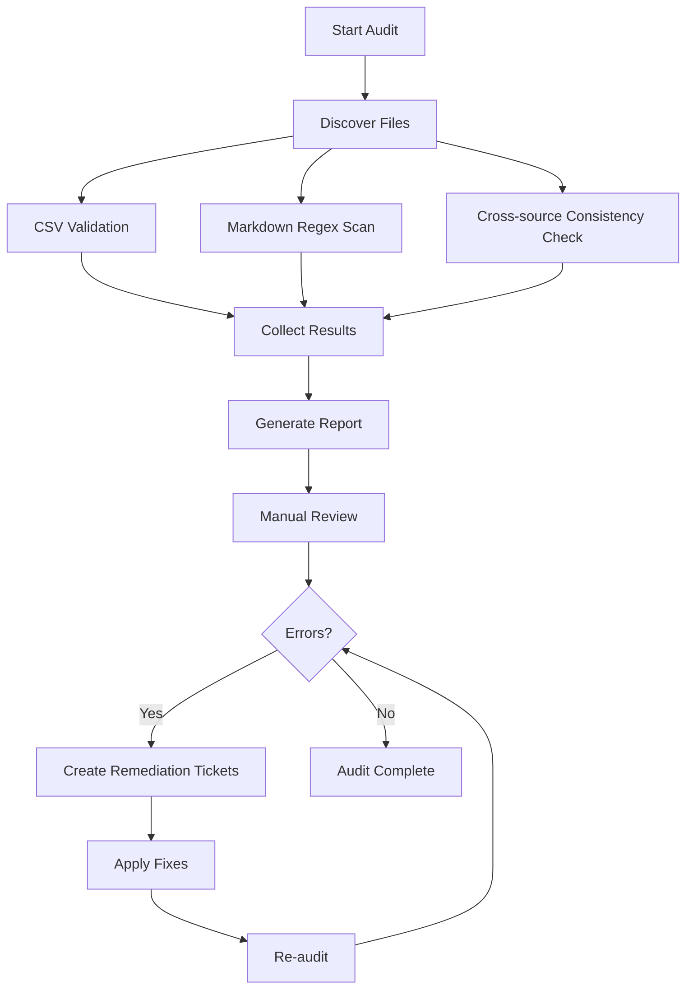

# Data Integrity Audit Plan v1.0

## 1. Project Overview and Audit Goals

This plan outlines a systematic audit of all data assets in the Madhav project to ensure high integrity, consistency, and accuracy across all files. The audit aims to:

- **Detect and eliminate historical errors** such as Jupiter placed in Cancer 4H (instead of Sagittarius 9H), Shree Lagna in 9H (instead of 7H), Ghati Lagna in 8H (instead of 9H), and other similar misplacements.
- **Validate cross‑source consistency** for key astrological placements (planets, special lagnas, Sahams) across the entire corpus.
- **Establish a repeatable validation framework** for each data type (CSV, markdown, structured mappings) that can be run automatically.
- **Produce a remediation‑ready report** that prioritizes issues and tracks fixes.

## 2. Scope and Boundaries

**In scope:**
- All markdown documents in `00_ARCHITECTURE/`, `01_FACTS_LAYER/` (excluding JHora transcription and CSV files), `02_ANALYTICAL_LAYER/`, `03_DOMAIN_REPORTS/`, `04_REMEDIAL_CODEX/`, `05_TEMPORAL_ENGINES/`, `06_QUERY_INTERFACE/`, `025_HOLISTIC_SYNTHESIS/`.
- Structured mapping files (`MATRIX_*.md`, `FORENSIC_*.md`), excluding `JHORA_TRANSCRIPTION_*.md`.
- Configuration files (`package.json`, `*.config.*`) for syntactic validity.

**Out of scope:**
- Binary files (images, `.docx`).
- Generated code in `platform/` (except for configuration validation).
- External dependencies.
- CSV files (`ECLIPSES_1900_2100.csv`, `EPHEMERIS_MONTHLY_1900_2100.csv`, `RETROGRADES_1900_2100.csv`, `SADE_SATI_CYCLES_ALL.md`).
- JHora transcription files (`JHORA_TRANSCRIPTION_*.md`).

## 3. Inventory of Data Assets

| Category | File Pattern | Example Files | Validation Focus |
|----------|--------------|---------------|------------------|
| **Markdown Reports** | `*.md` | Domain reports (`REPORT_*.md`), analytical layers (`DEEP_ANALYSIS_*.md`), synthesis documents (`MSR_*.md`, `UCN_*.md`) | Consistency of astrological placements, detection of known error patterns, cross‑reference accuracy |
| **Structured Mappings** | `MATRIX_*.md`, `FORENSIC_*.md` | `MATRIX_PLANETS.md`, `MATRIX_HOUSES.md`, `FORENSIC_ASTROLOGICAL_DATA_v8_0.md` | Key‑value consistency, house‑sign‑planet alignment, absence of contradictions |
| **Configuration & Metadata** | `package.json`, `*.config.*`, `.gitignore` | `platform/package.json`, `eslint.config.mjs`, `next.config.ts` | Syntactic validity, required fields, dependency version sanity |

## 4. Validation Framework per Data Type

### 4.1 Markdown Documents
- **Placement consistency**: Any statement of a planet, lagna, or Saham in a specific house must match the authoritative source (`FORENSIC_ASTROLOGICAL_DATA_v8_0.md`).
- **Cross‑reference validity**: Internal links (e.g., `[MSR.391]`) must point to existing anchors.
- **Detection of known error patterns**: Use regex‑based scanning for the historical mistakes listed in §6.

### 4.2 Structured Mappings
- **Key‑value alignment**: Ensure that each matrix row (e.g., planet‑house‑sign) is consistent with the natal chart.
- **Contradiction detection**: Compare equivalent values across different files (e.g., Jupiter’s house in `MATRIX_PLANETS.md` vs. `FORENSIC_v8_0.md`).

### 4.3 Configuration Files
- **Syntax validation**: Validate JSON, YAML, or JavaScript syntax.
- **Required fields**: Check for mandatory fields (e.g., `name`, `version` in `package.json`).

## 5. Cross‑source Consistency Checks

The following key data points must be identical across all files that mention them. The authoritative source is `FORENSIC_ASTROLOGICAL_DATA_v8_0.md` (JHora v8.0 export).

| Data Point | Authoritative Value (House/Sign) | Files to Check |
|------------|----------------------------------|----------------|
| Jupiter placement | Sagittarius 9H | `MATRIX_PLANETS.md`, `DEEP_ANALYSIS_*.md`, all domain reports |
| Shree Lagna | Libra 7H | `MATRIX_*.md`, `MSR_*.md`, `REPORT_FINANCIAL_*.md`, `REPORT_RELATIONSHIPS_*.md` |
| Ghati Lagna | Sagittarius 9H | `MATRIX_*.md`, `MSR_*.md`, `UCN_*.md` |
| Varnada Lagna | Cancer 4H | `MATRIX_*.md`, `MSR_*.md`, `UCN_*.md` |
| Hora Lagna | Gemini 3H | `MATRIX_*.md`, `MSR_*.md`, `REPORT_FINANCIAL_*.md`, `REPORT_RELATIONSHIPS_*.md` |
| Saham Roga | Taurus 2H | `MSR_*.md`, `REPORT_HEALTH_*.md`, `REPORT_RELATIONSHIPS_*.md`, `CDLM_*.md` |
| Saham Mahatmya | Sagittarius 9H | `MSR_*.md`, `REPORT_HEALTH_*.md`, `REPORT_RELATIONSHIPS_*.md` |
| Saham Vivaha | Cancer 4H | `MSR_*.md`, `REPORT_RELATIONSHIPS_*.md` |
| “Hidden pinnacle” concept | **Invalid** (neither Varnada nor Ghati in 8H) | Any file that mentions `Varnada+Ghati 8H` or `hidden pinnacle` |

**Validation method**: Extract each occurrence with a regex capture group, compare against the authoritative value, flag mismatches.

## 6. Historical Error Patterns Detection Rules

The following regular expressions (case‑insensitive) will be used to scan all `.md` files for residues of past computational errors.

| Error Pattern | Regex | Expected Correction |
|---------------|-------|---------------------|
| Jupiter in Cancer 4H | `Jupiter.*4[Hh]` (context) | Jupiter in Sagittarius 9H |
| Jupiter aspects 10H/8H/12H from 4H | `Jupiter.*aspect.*(10H\|8H\|12H)` | Jupiter’s aspects are from 9H, not 4H |
| Shree Lagna in 9H | `Shree.*9[Hh]\|9[Hh].*Shree` | Shree Lagna in 7H |
| Ghati Lagna in 8H | `Ghati.*8[Hh]` | Ghati Lagna in 9H |
| Varnada Lagna in 8H | `Varnada.*8[Hh]` | Varnada Lagna in 4H |
| Hora Lagna in 7H | `Hora.*7[Hh]\|HL.*7[Hh]` | Hora Lagna in 3H |
| Roga Saham in 7H | `Roga.*7[Hh]\|Saham.*Roga.*7[Hh]` | Roga Saham in 2H |
| Mahatmya Saham in 7H | `Mahatmya.*7[Hh]\|Saham.*Mahatmya.*7[Hh]` | Mahatmya Saham in 9H |
| Vivaha Saham in 3H | `Vivaha.*3[Hh]\|Saham.*Vivaha.*3[Hh]` | Vivaha Saham in 4H |
| “Hidden pinnacle” phrase | `hidden.*pinnacle\|Varnada.*Ghati.*8[Hh]` | Concept invalid; remove reference |
| Rao misassignment (if any) | `Rao.*[0‑9][Hh]\|[0‑9][Hh].*Rao` | Verify correct attribution |

**Note**: Each match must be manually reviewed to avoid false positives (e.g., “Jupiter in Cancer 4H” could be a transit reference). The audit script will output file, line number, and surrounding context for human verification.

## 7. Audit Execution Protocol

### 7.1 Tools & Environment
- **Primary language**: Python 3.6+ (standard libraries only).
- **Secondary tools**: `grep`, `jq`, `csvtool` for quick validations.
- **Environment**: macOS/Linux shell; the script will be run from the workspace root (`/Users/Dev/Vibe‑Coding/Apps/Madhav`).

### 7.2 Script Structure
A single Python script `audit.py` will implement:

1. **File discovery** – recursive walk, filtering by extension.
2. **CSV validation** – using `csv.reader`.
3. **Markdown regex scanning** – using `re` with compiled patterns.
4. **Cross‑source consistency** – building a dictionary of key placements from authoritative sources, then scanning other files.
5. **Reporting** – generating a markdown report (`AUDIT_REPORT_<timestamp>.md`) with findings.

### 7.3 Step‑by‑Step Execution
1. **Clone the repository** (if not already local) and ensure a clean working tree.
2. **Run the audit script**:
   ```bash
   python audit.py --path . --output audit_report.md
   ```
3. **Manual review** of the generated report, confirming each flagged item.
4. **Create GitHub issues** (or a tracking spreadsheet) for each confirmed error.
5. **Apply fixes** – either manually or via batch search‑and‑replace where safe.
6. **Re‑run audit** to verify resolution.

### 7.4 Automation & CI Integration
- The script can be hooked into a pre‑commit hook or a GitHub Action to prevent regressions.
- A lightweight configuration file (`audit_config.yaml`) can be added to allow customization of patterns and authoritative sources.

## 8. Audit Report Format

The audit script will produce a markdown report with the following sections:

```markdown
# Data Integrity Audit Report – <timestamp>

## Executive Summary
- Total files scanned: X
- Errors found: Y (critical/high/medium/low)
- Cross‑source inconsistencies: Z

## 1. Inventory of Scanned Files
- List of files with status (OK / ERROR).

## 2. CSV Validation Results
| File | Row | Issue | Severity |
|------|-----|-------|----------|
| …    | …   | …     | …        |

## 3. Markdown Error‑Pattern Matches
| File | Line | Match | Pattern | Suggested Fix |
|------|------|-------|---------|---------------|
| …    | …    | …     | …       | …             |

## 4. Cross‑source Inconsistencies
| Data Point | Expected | Found In | File:Line | Severity |
|------------|----------|----------|-----------|----------|
| …          | …        | …        | …         | …        |

## 5. Recommendations
- Prioritized list of actions (critical first).
- Suggested search‑and‑replace commands.

## 6. Remediation Tracking
| ID | Issue | Assigned | Status | Due Date | Notes |
|----|-------|----------|--------|----------|-------|
| …  | …     | …        | …      | …        | …     |
```

## 9. Remediation Tracking Process

- Each confirmed issue will be logged as a row in a CSV file (`remediation_tracking.csv`) with columns: `ID`, `Issue`, `File`, `Line`, `Assigned`, `Status`, `DueDate`, `Notes`.
- Status values: `Open`, `In Progress`, `Fixed`, `Verified`.
- Weekly review of the tracking file to update progress.
- After fixes are applied, the audit script will be re‑run to verify and close issues.

## 10. Implementation Timeline & Next Steps

1. **Day 1** – Finalize audit script (`audit.py`) and test on a subset of files.
2. **Day 2** – Run full audit, generate report, and conduct manual review.
3. **Day 3** – Create remediation tickets and assign.
4. **Days 4‑7** – Execute fixes, re‑audit, and update documentation.
5. **Day 8** – Integrate audit into CI pipeline (optional).

**Immediate next steps:**
- Review this plan with stakeholders.
- Approve the detection rules and authoritative sources.
- Begin development of the audit script.

## 11. Appendices

### 11.1 Full List of Detection Regex Patterns
```python
PATTERNS = [
    (r'Jupiter.*4[Hh]', 'Jupiter placement error (should be 9H)'),
    (r'Jupiter.*aspect.*(10H|8H|12H)', 'Jupiter aspect from wrong house'),
    (r'Shree.*9[Hh]|9[Hh].*Shree', 'Shree Lagna should be 7H'),
    # … etc.
]
```

### 11.2 Sample Audit Script Skeleton
```python
import os, re, csv, json
from pathlib import Path

def scan_markdown(filepath, patterns):
    # implementation
    pass

def validate_csv(filepath):
    # implementation
    pass

# Main loop
if __name__ == '__main__':
    # discover files, run validations, generate report
    pass
```

### 11.3 Mermaid Diagram: Audit Workflow



---
*Document version: 1.0*  
*Created: 2026‑04‑19*  
*Owner: Architecture Team*  
*Status: Draft – Pending Review*
